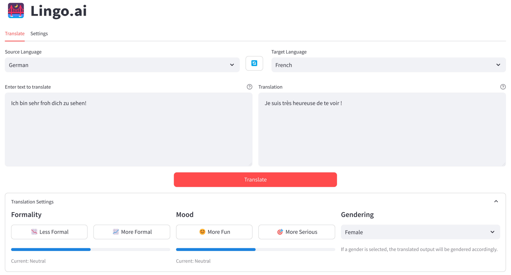

# 🌉 Lingo.ai

Lingo is a Streamlit-based application that facilitates LLM text translations. It provides a super simple user interface and integrates with Google [Gemini](https://deepmind.google/technologies/gemini/), and hence can translate from/to **more than 100 languages**.

### ➡️ [Access the app!](https://lingo-ai.streamlit.app/)

## Setup

1. Obtain a [Google AI Studio API key](https://aistudio.google.com/app/apikey)
2. Go to the [Lingo.ai app](https://lingo-ai.streamlit.app/)
3. Enter your API Key in the text box in the "Settings" tab
4. Start translating!

  

## Features

A simple to use interface, that comes with customizable translation parameters, including:
* Formality control (make the translation sound less or more formal)
* Tone adjustment (make the translation sound happier or more serious)
* Gendered translations (language dependent)

---
❤️ Open Source
